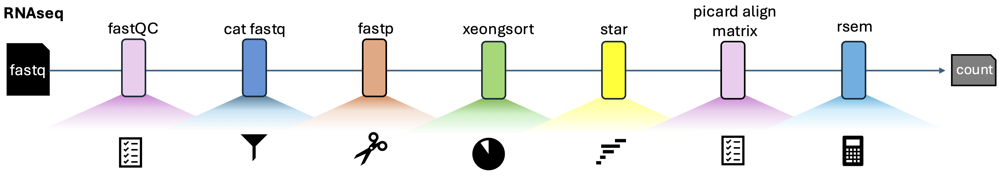

# RNAseq Snakemake Workflow

**Version: 202509**



This workflow provides an end-to-end RNAseq analysis pipeline for **PDX**, **PDO**, and **Patient Tissue** samples, customized for the **HPC4Health Slurm cluster**.  
It integrates widely used bioinformatics tools with cluster-optimized execution.

---

## 🔍 Workflow Overview

The pipeline consists of the following steps:

1. **Quality Control & Trimming** – `fastp`  
2. **Host/DNA Filtering (optional)** – `xengsort` (run only for PDX samples)  
3. **Alignment** – `STAR`
4. **Alignment Metrics** – `Picard CollectAlignmentSummaryMetrics`  
5. **Quantification** – `RSEM`

**Inputs:**  
- FASTQ files (single-end or paired-end)  
- Human/mouse reference genome, annotations, and indexes (provided separately)

**Outputs:**  
- QC reports (`results/fastp/`, `results/picard/`)  
- Aligned BAM files (`results/star/`)  
- Gene- and transcript-level expression estimates (`results/rsem/`)  

---

## 🛠️ Software Stack

| Tool   | Purpose                                | Version (recommended) |
|--------|----------------------------------------|-----------------------|
| fastp  | FASTQ QC and adapter trimming          | 0.23.1                |
| xengsort | Host/DNA filtering (for PDX samples) | 2.0.9                 |
| STAR   | RNAseq read alignment                  | 2.7.3a                |
| RSEM   | Gene/transcript quantification         | 1.3.0                 |
| Picard | Alignment metrics & RNAseq QC          | 2.10.9                |
| Snakemake | Workflow engine                     | 6.15.3 (tested)       |

---

## ⚙️ Setup Instructions

### 1. Home Directory Setup
#### 1.1 Create Snakemake Environment

Start a build node session:
```bash
salloc --partition=build -c 1 -t 2:0:0 --mem 2G
```
Install Snakemake v6.15.3:
```bash
conda install -n base -c conda-forge mamba
mamba create -c conda-forge -c bioconda -n snakemake6153 snakemake=6.15.3
```
Activate the environment:
```bash
conda activate snakemake6153
```

#### 1.2 Clone Workflow Repository

```bash
cd ~/workflows
git clone git@github.com:UHN-PMLB/RNAseq_PDX_PDO_PatientTissue_Snakemake_v202509.git
```
Clone the workflow into home directory first.

#### 1.3 Generate Xengsort Singularity Images (Required for PDX, Optional for PDO, PatientTissue)

[Singularity Image](https://quay.io/repository/biocontainers/xengsort?tab=tags)

```bash
cd RNAseq_PDX_PDO_PatientTissue_Snakemake_v202509/env
module load apptainer/1.0.2
apptainer build xengsort209.sif docker://quay.io/biocontainers/xengsort:2.0.9--pyhdfd78af_0
```

### 2. Project Directory Setup
#### 2.1 Start an interactive session

```bash
salloc -c 1 -t 2:0:0 --mem 2G
```
Move the workflow to your working directory.

#### 2.2 Configure `config/samples.tsv`

| sample_name | sample_type    | single_pair_end | fq1                           | fq2                           |
|-------------|----------------|-----------------|-------------------------------|-------------------------------|
| SAMPLE001   | PDX            | pe              | /path/to/data/SAMPLE001_R1.fq | /path/to/data/SAMPLE001_R2.fq |
| SAMPLE002   | PDO            | pe              | /path/to/data/SAMPLE002_R1.fq | /path/to/data/SAMPLE002_R2.fq |
| SAMPLE003   | PatientTissue  | pe              | /path/to/data/SAMPLE003_R1.fq | /path/to/data/SAMPLE003_R2.fq |

- `sample_type` determines whether `xengsort` is run (`PDX = yes`, `PDO/PatientTissue = skipped`).
- `single_pair_end` should be `se` for `single-end` data, `pe` for `paired-end`.

#### 2.3 Configure `workflow/Snakefile`

Update the `workdir` parameter to point to your working directory.

#### 2.4 Reference Data (`ref/`)

The `ref/` directory contains genome FASTA, annotations (GTF), and prebuilt STAR/RSEM indexes.
Please contact the workflow maintainer to obtain and transfer the reference data to HPC.

#### 2.5 Final Project Structure

After everything is setup, your working directory should have the following structure:

```
.
├── LICENSE
├── README.md
├── config
│   ├── config.yaml
│   └── samples.tsv
├── env
│   ├── README.md
│   └── xengsort209.sif
├── images
│   └── RNAseq_workflow-diagram.png
├── ref
│   └── genomes
│       ├── human
│       │   └── GRCh38
│       │       ├── GTF
│       │       │   └── genome.gtf
│       │       ├── STAR
│       │       │   └── STAR_GRCh38_150
│       │       │       ├── Genome
│       │       │       ├── SA
│       │       │       ├── SAindex
│       │       │       ├── chrLength.txt
│       │       │       ├── chrName.txt
│       │       │       ├── chrNameLength.txt
│       │       │       ├── chrStart.txt
│       │       │       ├── exonGeTrInfo.tab
│       │       │       ├── exonInfo.tab
│       │       │       ├── geneInfo.tab
│       │       │       ├── genomeParameters.txt
│       │       │       ├── sjdbInfo.txt
│       │       │       ├── sjdbList.fromGTF.out.tab
│       │       │       ├── sjdbList.out.tab
│       │       │       └── transcriptInfo.tab
│       │       ├── downloadGenome.sh
│       │       ├── genome.fa
│       │       ├── genome.fa.amb
│       │       ├── genome.fa.ann
│       │       ├── genome.fa.bwt
│       │       ├── genome.fa.pac
│       │       └── genome.fa.sa
│       ├── mouse
│       │   └── grcm38
│       │       ├── genome.HouseKeepingGenes.bed
│       │       ├── genome.chrom.sizes
│       │       ├── genome.dict
│       │       ├── genome.fasta
│       │       └── genome.fasta.fai
│       └── xengsortidx_grcm38_grch38
│           ├── xengsortidx.hash
│           └── xengsortidx.info
├── slurm
│   ├── CookieCutter.py
│   ├── __pycache__
│   │   ├── CookieCutter.cpython-310.pyc
│   │   └── slurm_utils.cpython-310.pyc
│   ├── cluster.json
│   ├── config.yaml
│   ├── settings.json
│   ├── slurm-jobscript.sh
│   ├── slurm-status.py
│   ├── slurm-submit.py
│   └── slurm_utils.py
└── workflow
    ├── Snakefile
    ├── rules
    │   ├── align.smk
    │   ├── common.smk
    │   ├── countmatrix.smk
    │   └── ref.smk
    └── scripts
        ├── common
        │   └── __init__.py
        ├── count-matrix.py
        ├── prepare-rsem-reference.py
        └── rsem-generate-data-matrix-modified.pl

20 directories, 43 files
```

---

## ▶️ Running the Workflow

### 1. Activate conda environment

```bash
mamba activate snakemake6153
```

### 2. Dry-run (test only, no jobs executed)

```bash
snakemake -n -p
```

### 3. Run locally with a few cores

```bash
snakemake --cores 4
```

### 4. Submit to SLURM

```bash
sbatch scheduler.sh
```

---

## 📂 Output Structure

- results/fastp/ – QC reports in HTML/JSON
- results/star/ – Aligned BAM files + STAR logs
- results/picard/ – Alignment metrics (Picard CollectAlignmentSummaryMetrics)
- results/rsem/ – Gene and transcript quantifications

---

## 📌 Notes

This workflow is optimized for HPC4Health Slurm. Adapt scheduler settings (scheduler.sh) for other clusters.

---

## 👤 Contact

For questions or support, please contact:
[Guanqiao Feng] – [guanqiao.feng@uhn.ca]
